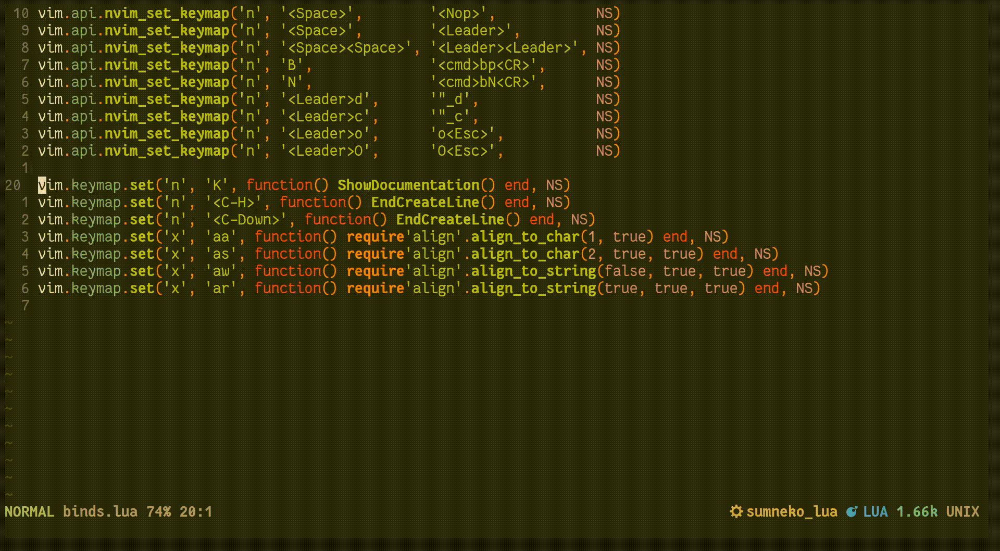

# align.nvim

### align.nvim is a minimal plugin for NeoVim for aligning lines

align.nvim supports aligning lines to the most feasible leftward or rightmost character, string, or Lua pattern.

Escapes for Lua patterns can either be % or \\, the latter both of which can be escaped again with another \\.

### Installation

Packer
```lua
use 'Vonr/align.nvim'
```

### Usage

Bind the functions to your preferred bindings and use them in Visual or Visual Lines mode.

This plugin does not and will not provide any default mappings or commands for the foreseeable future.

Preview mode is opt-in as it currently messes up the undotree, please open a Pull Request if you have any ideas to rectify this.

Suggested mappings:

```lua
-- align_to_char(length, reverse, preview, marks)
-- align_to_string(is_pattern, reverse, preview, marks)
-- align(str, reverse, marks)
-- operator(fn, opts)
-- Where:
--      length: integer
--      reverse: boolean
--      preview: boolean
--      marks: table (e.g. {1, 0, 23, 15})
--      str: string (can be plaintext or Lua pattern if is_pattern is true)

local NS = { noremap = true, silent = true }

vim.keymap.set('x', 'aa', function() require'align'.align_to_char(1, true)             end, NS) -- Aligns to 1 character, looking left
vim.keymap.set('x', 'as', function() require'align'.align_to_char(2, true, true)       end, NS) -- Aligns to 2 characters, looking left and with previews
vim.keymap.set('x', 'aw', function() require'align'.align_to_string(false, true, true) end, NS) -- Aligns to a string, looking left and with previews
vim.keymap.set('x', 'ar', function() require'align'.align_to_string(true, true, true)  end, NS) -- Aligns to a Lua pattern, looking left and with previews

-- Example gawip to align a paragraph to a string, looking left and with previews
vim.keymap.set(
    'n',
    'gaw',
    function()
        local a = require'align'
        a.operator(
            a.align_to_string,
            { is_pattern = false, reverse = true, preview = true }
        )
    end,
    NS
)

-- Example gaaip to aling a paragraph to 1 character, looking left
vim.keymap.set(
    'n',
    'gaa',
    function()
        local a = require'align'
        a.operator(
            a.align_to_char,
            { reverse = true }
        )
    end,
    NS
)
```


